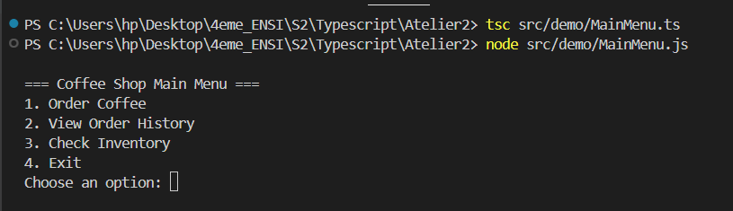

# ☕ Coffee Shop Management System

A TypeScript implementation of a coffee ordering system using design patterns and IndexedDB for persistence.

## Class Diagram 


## 🔧 Key Features

- **Order Management**
  - Multiple coffee types (Espresso, Latte)
  - Customizations (Milk, Sugar)
  - Real-time pricing

- **Inventory System**
  - Stock tracking
  - Automatic deduction
  - Restock capability

- **Data Persistence**
  - Order history saved in IndexedDB

## 🎨 Design Patterns Used

| Pattern         | Implementation          | Benefit |
|----------------|-------------------------|---------|
| **Singleton**  | `InventoryManager`      | Single source of truth for inventory |
| **Factory**    | `CoffeeFactory`         | Encapsulated object creation |
| **Decorator**  | `WithMilk`, `WithSugar` | Dynamic customization without inheritance |
| **DAO**       | `CoffeeDB`             | Abstracted database operations |

## 🚀 Getting Started
### Prerequisites
- Node.js (v14+)
- npm/yarn
### Installation
- Install dependencies:
```bash
npm install
npm install -g ts-node typescript
```
### Running the Application
1. Run the Cli
```bash
npx ts-node src/demo/MainMenu.ts
```
2. Follow menu prompts

## 🏗️ Architecture Overview
**models** # Coffee types and decorators
- Coffee.ts # Base interface
- Espresso.ts # Coffee implementation
- Latte.ts # Coffee implementation
- WithMilk.ts # Customizations
- WithSugar.ts# Customizations 
**services** # Core logic
- CoffeeFactory.ts # Object creation
- InventoryManager.ts # Stock control
- CoffeeDB.ts # Database access
- CoffeeShop.ts # Main system
**Demo**
- MenuService.ts # Interactive menu
- demo.ts 


## Class Documentation
**Core Models**
- Coffee: Base interface
- Espresso/Latte: Coffee implementations

**Decorators**
- WithMilk: +0.5€
- WithSugar: +0.3€

**Services**
- CoffeeFactory: Creates coffee instances
- InventoryManager: Manages stock (Singleton)
- CoffeeDB: Handles database operations

## Demo
**Running program**



**Order coffee**


**View order history**


**Check Inventory**


